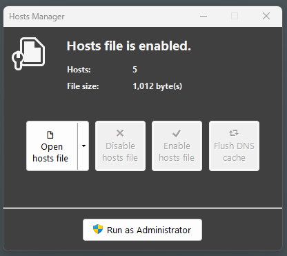
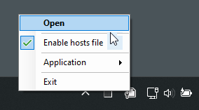
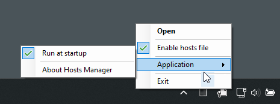

# Hosts Manager

**Just another Windows hosts file manager.** Hosts Manager is a ***Developer*** tool, a small, simple, Windows system tray application. Using Hosts Manager you can quickly open your **hosts** file (read-only). When elevated, you can edit, enable/disable all hosts and quickly clear your local DNS cache.

### Elevation ###
**Note:** The **hosts** file in Windows is protected and requires elevation to make changes. Hosts Manager allows you to quickly elevate, open and edit your **hosts** file.

### [New!] Open with your preferred Editor ###
Hosts Manager now supports opening your **hosts** file with **Notepad++** or **Visual Studio Code**. More editors coming soon!

### System tray ###
Hosts Manager is a system tray application, it will automatically minimize to your system tray. By default, Hosts Manager will start (minimized). You can disable auto-start by un-checking 'Run at startup' in the system tray Application menu. To exit Hosts Manager, right click the system tray icon and select **Exit**.

